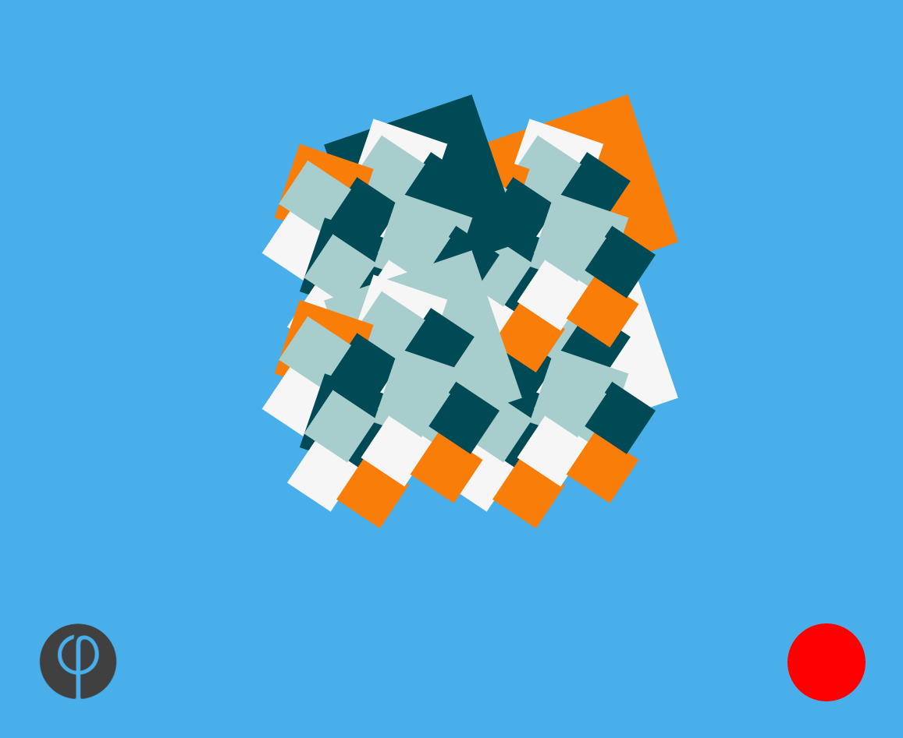

# FractalGen
> A simple fractal generator made with the Famous.js engine for funzies

## Description

Generates spinning fractal patterns with two buttons to increase and decrease fractal levels.



The button on the left, marked by the Famous logo 
, can be clicked to generate the next level of the fractal. The red button on the right can be clicked to remove the deepest level of the fractal.

---

## Installation

Nothing to it. Just clone it and then install dependencies with npm.

```bash
git clone https://github.com/ananthamapod/FractalGen
cd FractalGen
npm install
```

---

## Running
*From the Famous Seed Project:*

Run the dev server with ```npm run dev```

Now the dev server should be running on localhost:1618

Run the linters with ```npm run lint```

Run All Tests with ```npm test```

---

## LICENSE

[LICENSE](LICENSE)
